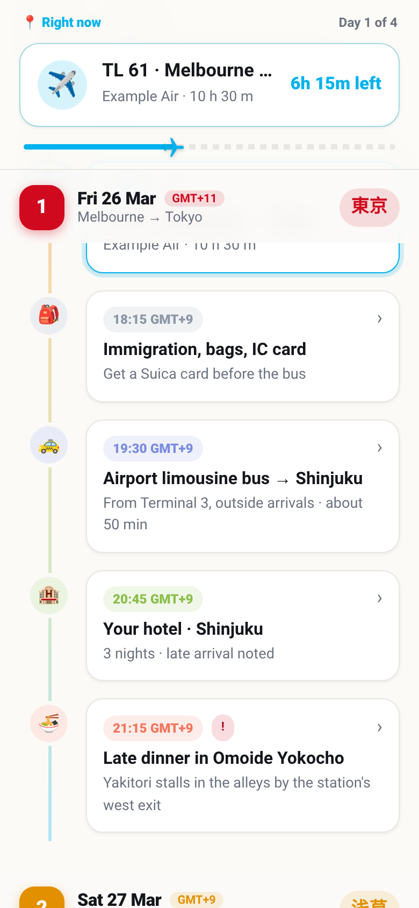
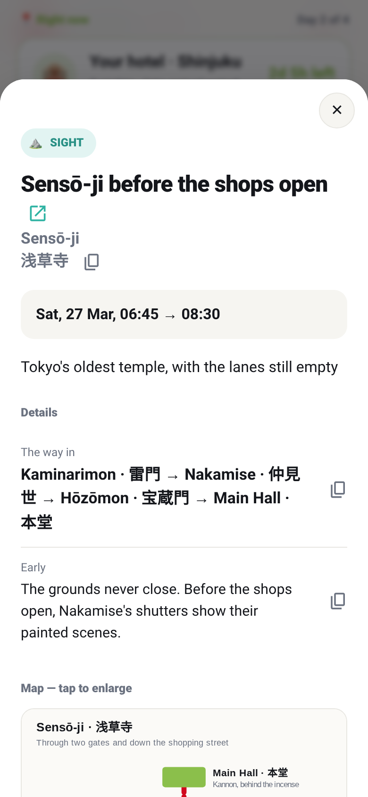
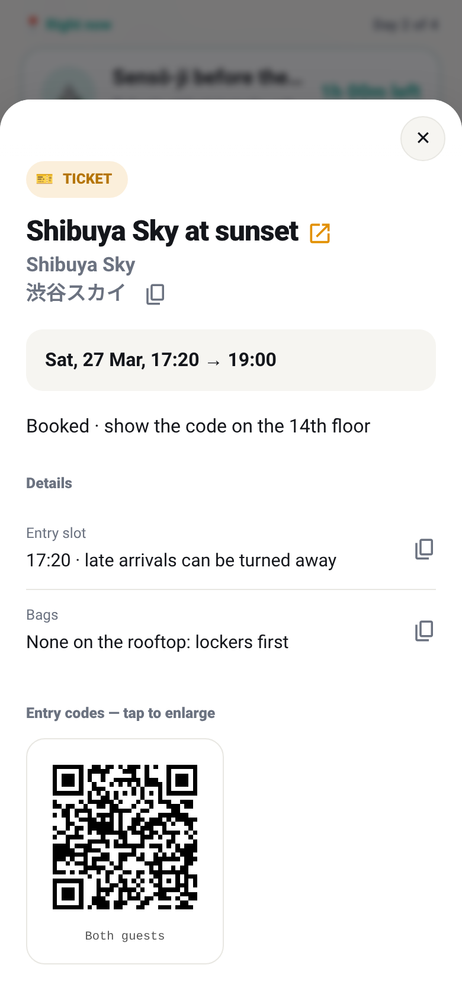
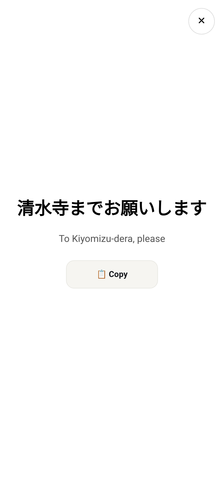

# 

**Hand your bookings to your AI agent and get an offline trip app you can install on your phone.**

<p>
  
  
  
  
</p>

**See it live:** [tokyo2027.tripline.workers.dev](https://tokyo2027.tripline.workers.dev/)
is the example trip, Melbourne to Tokyo. Open it on your phone and install it. The trip is in
2027, so add [`?now=2027-03-26T14:00`](https://tokyo2027.tripline.workers.dev/?now=2027-03-26T14:00)
to see it mid-flight.

tripline turns your bookings into a small app (a PWA) that you install from the browser
onto your phone. It opens from your home screen, instantly, even with no signal. It shows what's happening now and what's next, with a countdown. Tap any event for its
details:

- addresses in the local script, ready to copy;
- seats and warnings;
- a Maps button;
- a card to show the driver;
- your QR codes and tickets.

You don't write any of it. Your AI agent (Claude, ChatGPT/Codex, Gemini, Cursor, Copilot…)
reads your bookings and builds the trip. [`AGENTS.md`](AGENTS.md) teaches it how.

## How it works

1. **Use this template** (the green button above) to get your own copy, and open it with your
   AI agent.
2. **Drop your bookings in [`bookings/`](bookings/):** confirmation PDFs, e-tickets, emails,
   screenshots. That folder is never committed.
3. **Ask your agent:**
   > Read AGENTS.md, then build my trip from everything in bookings/.
4. **Preview it** with `node tools/serve.mjs`. Add `?now=2027-03-27T07:30` to the URL to see any
   moment of the trip.
5. **Deploy it** (below), install it on your phone, and go.

## Features

- **Installable and offline.** It's a PWA: install it once and it works like an app, with no
  signal, no app store and no account. Updates never interrupt you.
- **Now and next.** It shows the current event, the next one, a countdown, and the progress of
  the day and the trip.
- **Local language.** Place names come in the local script, and the driver card goes fullscreen
  with a copy button.
- **Maps, links and files.** It has Google Maps buttons, live links (delays, webcams), and QR
  codes and tickets for the gate.
- **Weather.** It takes a baked-in forecast for each day, with an altitude correction for summit
  days.
- **Any language.** The app's own words and date formats can be changed per trip.
- **Add to calendar.** One tap downloads the whole trip as an `.ics` file for Apple, Google or
  Outlook calendar: flights, trains, stays, tickets and sights, with places and details. It
  works offline, and importing a newer file updates the trip instead of duplicating it.
- **Across time zones.** Each day, or a single flight, can be in its own zone. Every time reads
  as the local clock does there, daylight saving included.
- **Shareable.** `"shared": true` makes the checks refuse anything personal before you send the
  link to family.

There's no build step, no framework and no dependencies. The whole trip lives in one JSON file,
[`public/data/trip.json`](public/data/trip.json), described by
[`trip.schema.json`](trip.schema.json) and checked by `node tools/check.mjs`. The example trip
is four days from Melbourne to Tokyo, across two time zones.

## Install it on your phone

Open your trip's link on the phone, then:

- **iPhone or iPad (Safari):** tap Share, then **Add to Home Screen**.
- **Android (Chrome):** tap **Install** when the app offers it, or use the menu: **Install app**.
- **Desktop (Chrome, Edge):** use the install icon in the address bar.

The app offers this once by itself, and there's always an **Install as an app** button at the
bottom of the timeline. Once installed, it opens from the home screen as an app, and it keeps
working with no signal.

## Hosting

`public/` is a static site with no build step, so it runs on any static host.

**[Cloudflare](https://developers.cloudflare.com/workers/static-assets/)** is the suggested
one: free, and `wrangler.jsonc` is ready. Set its `name` to your trip (lowercase, digits and
dashes): it becomes the address, `<name>.<your-account>.workers.dev`. Then:

```sh
npx wrangler deploy --temporary
```

The site is live straight away, with no account needed yet. Within 60 minutes, open the claim
link it prints and sign up or log in to keep it; unclaimed, it's deleted. After that, deploy
with `npx wrangler login` once, then `npx wrangler deploy`.

**Deploy on every push:** add `CLOUDFLARE_API_TOKEN` (an API token from the
**Edit Cloudflare Workers** template) and `CLOUDFLARE_ACCOUNT_ID` as repo secrets. The workflow
runs the checks, then deploys. Until the secrets are there, it only runs the checks.

**Anywhere else** (GitHub Pages, Netlify, Vercel, your own server): publish the `public/`
folder as it is, with no build command. Set the headers from
[`public/_headers`](public/_headers) there too: the page and `sw.js` must not be cached, or
installed phones won't see updates.

## Privacy

The site is public to anyone with the link. It carries `noindex`, so search engines skip it, but
it is not private. While you travel, keep it to yourself. Before sharing it, set
`"shared": true` and let your agent clean it up. Your `bookings/` folder never leaves your
machine through git.

## License

[MIT](LICENSE)
